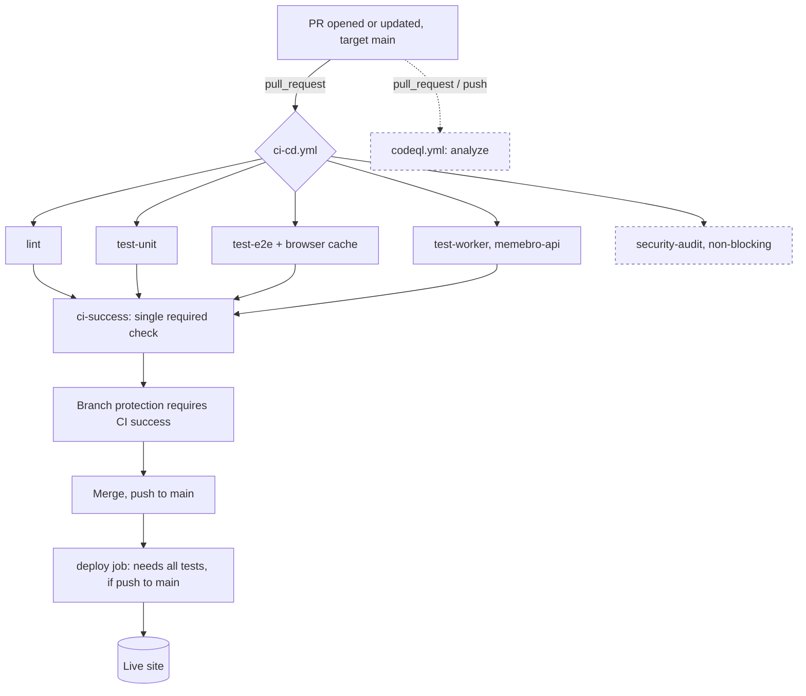

# CI/CD pipeline

How MemeBro's automation works: which workflows exist, what they run, when they
fire, and what is still open. This is a reference doc (like
[`interface-contract.md`](interface-contract.md)), not a decision record. The
gating choice it describes is recorded in
[`adr/0010-gate-deploy-on-ci.md`](adr/0010-gate-deploy-on-ci.md).

## TL;DR

Deploy is **gated on CI**. Everything lives in one workflow (`ci-cd.yml`): the
`deploy` job runs only after `lint`, `test-unit`, `test-e2e`, and `test-worker`
all pass, and only on a push to `main`. A push that breaks any check never
reaches GitHub Pages. A separate `codeql.yml` runs static security analysis, and
Dependabot keeps dependencies and Actions current.

## Workflows at a glance

| File                           | Name             | Triggers                                          | Jobs                                                                                     |
| ------------------------------ | ---------------- | ------------------------------------------------- | ---------------------------------------------------------------------------------------- |
| `.github/workflows/ci-cd.yml`  | "CI/CD Pipeline" | `pull_request → main`, `push → main`              | `lint`, `test-unit`, `test-e2e`, `test-worker`, `security-audit`, `ci-success`, `deploy` |
| `.github/workflows/codeql.yml` | "CodeQL"         | `push → main`, `pull_request → main`, weekly cron | `analyze`                                                                                |
| `.github/dependabot.yml`       | Dependabot       | weekly                                            | npm (`/`), npm (`/memebro-api`), github-actions (`/`)                                    |

The standalone `deploy.yml` was removed; deployment is now a gated job inside
`ci-cd.yml`.

## How it runs

```text
 +---------------------------------------------------------------+
 |  Dev opens / updates a Pull Request  ->  target branch: main  |
 +-------------------------------+-------------------------------+
                                 |  on: pull_request
                                 v
                 ci-cd.yml  -  "CI/CD Pipeline"
  +---------+-----------+-----------+-------------+---------------+
  | lint    | test-unit | test-e2e  | test-worker | security-audit|
  |         |           | (+browser |  (memebro-  | (npm audit,   |
  |         |           |  cache)   |   api npm   |  non-blocking)|
  |         |           |           |   test)     |               |
  +----+----+-----+-----+-----+-----+------+------+-------+-------+
       |          |           |            |              |
       +----------+-----+-----+------------+        (informational,
                        |                            not a gate)
                        v
                  ci-success  (one required check; green only if
                               all four required jobs succeeded)
                        |
       +----------------+-----------------+
       |  Branch protection requires      |
       |  "CI success" before Merge       |
       +----------------+-----------------+
                        v
              Merge  ->  push to main
                        |
                        v
        deploy  (needs: lint, test-unit, test-e2e, test-worker;
                 if: push AND ref == main; concurrency group "pages")
        checkout -> configure-pages
        -> upload-pages-artifact(path: '.') -> deploy-pages  ->  LIVE SITE

   In parallel on push/PR to main:  codeql.yml -> analyze (security scan)
```

The same flow as a graph:



## Job by job

Every CI job shares the same setup
(`checkout -> setup-node@20 + npm cache -> npm ci`) and then diverges. The test
jobs have no `needs:`, so they fan out in parallel; `ci-success` and `deploy`
depend on them.

- **`lint`** runs `npm run lint` (ESLint, Stylelint, HTMLHint, markdownlint, a
  custom JSON validator), then `prettier --check .`.
- **`test-unit`** runs `vitest run` in jsdom, collecting `tests/unit/**/*.test.js`.
- **`test-e2e`** caches the Playwright browser binaries (keyed on
  `package-lock.json`), installs Chromium, then runs `playwright test` against a
  static server on `http://localhost:3000`.
- **`test-worker`** runs `npm ci && npm test` inside `memebro-api/`, so the
  Cloudflare Worker backend is covered by the same gate as the frontend.
- **`security-audit`** runs `npm audit --audit-level=high` as
  `continue-on-error`. It surfaces advisories without blocking merges; Dependabot
  drives the fixes.
- **`ci-success`** depends on the four required jobs and fails if any failed or
  was cancelled. This is the single status check branch protection should
  require, so renaming an individual job cannot silently weaken the gate.
- **`deploy`** runs only on `push` to `main`, only after the four required jobs
  pass. It holds `pages: write` / `id-token: write` (scoped to this job, not the
  whole workflow), publishes via `upload-pages-artifact` / `deploy-pages`, and
  uses the `pages` concurrency group so deploys never cancel each other.

Workflow-level `concurrency` cancels superseded **PR** runs to save minutes but
never cancels a push to `main` mid-run.

## Local quality gates

A husky `pre-commit` hook runs `lint-staged` on staged files: `prettier --write`
plus `eslint --fix` (JS) and `stylelint --fix` (CSS). This catches the most
common CI failures (formatting, lint) before they ever reach a PR. The hook
installs automatically on `npm install` via the `prepare` script. CI remains the
source of truth; the hook is a fast first pass, not a replacement.

## What is still open

| #   | Gap                                   | Why it matters                                                                                                               | Status / next step                                                                                                      |
| --- | ------------------------------------- | ---------------------------------------------------------------------------------------------------------------------------- | ----------------------------------------------------------------------------------------------------------------------- |
| 3   | Unit-test glob is a silent blind spot | `vitest` only collects `tests/unit/**/*.test.js`; a test placed elsewhere collects zero tests and still reports green.       | Add a coverage floor or a minimum-test-count assertion so "0 collected" fails. Deferred.                                |
| 4   | No coverage measurement or threshold  | Coverage can erode silently as the code grows, and it is usually a graded deliverable.                                       | Measure current coverage first, then enable `vitest --coverage` with a floor at-or-below it. Deferred (could break CI). |
| 5   | Pre-existing dependency advisories    | `npm audit` reports high/moderate ReDoS advisories in the `markdownlint` / `markdown-it` dev chain (fix is a breaking bump). | Dependabot will propose the bump; review and merge separately. CodeQL + the audit job now make this visible.            |
| 6   | Pages artifact uses `path: '.'`       | Publishes the entire repo (tests, `docs/`, `research/`) to the public site, bloating the deploy and exposing dev files.      | Stage a curated publish dir and verify the live site before flipping. Deferred (high blast radius).                     |

Closed in this work: deploy is now gated on CI (#1), the Worker is in CI (#2),
there is a single aggregating required check, Playwright browsers are cached,
superseded PR runs are cancelled, deploy permissions are scoped to the deploy
job, Dependabot and CodeQL are wired up, a pre-commit hook shifts lint/format
left, and the README shows CI status badges.

## Related decisions

- [`adr/0010-gate-deploy-on-ci.md`](adr/0010-gate-deploy-on-ci.md) — the gating decision (this work)
- [`adr/0002-deployment-target.md`](adr/0002-deployment-target.md)
- [`adr/0004-e2e-testing-framework.md`](adr/0004-e2e-testing-framework.md)
- [`adr/0005-unit-testing-framework.md`](adr/0005-unit-testing-framework.md)
- [`adr/0008-frontend-linting-toolchain.md`](adr/0008-frontend-linting-toolchain.md)
- [`adr/0009-backend-platform.md`](adr/0009-backend-platform.md)
